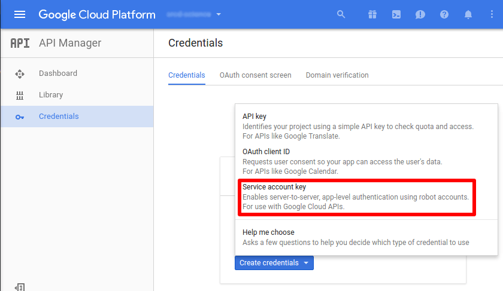

Jupyter FS in Google Cloud Storage [](https://pypi.python.org/pypi/jgscm) [](https://travis-ci.org/src-d/jgscm) [](https://codecov.io/gh/src-d/jgscm)
========================================

Jupyter Google Storage Contents Manager allows working with Jupyter notebooks directly in Google Cloud Storage.
It aims to be a complete drop-in replacement for the stock filesystem
[ContentsManager](http://jupyter-notebook.readthedocs.io/en/latest/extending/contents.html).
Thus JGSCM is only compatible with a relatively modern IPython/Jupyter stack (version 4 and above).

The root level of the virtual file system is the list of buckets, which
are presented as directories. In turn, each bucket is presented as an
ordinary folder where users can create files, subdirectories and notebooks.
Besides, snapshots are completely supported too.

Installation
------------
```
pip install jgscm
```
You must point to jgscm in [Jupyter settings](http://jupyter-notebook.readthedocs.io/en/latest/config.html).
Usually you'd need to edit `~/.jupyter/jupyter_notebook_config.py` and
insert the following:
```python
c.NotebookApp.contents_manager_class = 'jgscm.GoogleStorageContentManager'
# c.GoogleStorageContentManager.project = ''
# c.GoogleStorageContentManager.keyfile = ''
```
`project` and `keyfile` must be set if [gcloud](https://github.com/GoogleCloudPlatform/gcloud-python)
cannot determine the defaults. Read more about it in one of the next sections.

Contributions
-------------
...are welcome! See [CONTRIBUTING](CONTRIBUTING.md) and [code of conduct](CODE_OF_CONDUCT.md).

License
-------
MIT, see [LICENSE](LICENSE.md).

Usage
-----
Just launch and use Jupyter as usual.

On the root level, you may not create files, only directories and the latter
are considered as new buckets. On deeper levels, there should be no difference.
You can change the Google Cloud project in order to work with
corresponding buckets in Jupyter configuration (see [Projects and keyfiles](#projects-and-keyfiles)).

GCS treats blobs with names ending with "/" as folders and so does this
project. Since there is no special handling of directories in GCS,
when you delete some blob which is the only one in it's parent directory,
and the parent directory was not created explicitly, it will disappear as well.
This behavior is similar to some old-style source control systems.

GCS API invocations can take some time. While JGSCM does it's best to reduce
the number of calls, they still can introduce substantial delays in
Jupyter UI. Please, be patient.

There is an ability to specify the starting path instead of the buckets listing:
```python
c.GoogleStorageContentManager.default_path = 'path/without/starting/slash'
```
(`--notebook-dir` does not seem to work).

Checkpoints
-----------
Checkpoints are stored in .ipynb_checkpoints directory as usual. That
name can be changed via `c.GoogleStorageCheckpoints.checkpoint_dir` in
Jupyter configuration. You can set the dedicated bucket for snapshots via
`c.GoogleStorageCheckpoints.checkpoint_bucket`.

The name of each checkpoint is \<notebook name\>-[UUID4](https://en.wikipedia.org/wiki/Universally_unique_identifier).ipynb.

Hidden files and directories
----------------------------
As with any UNIX filesystem, files and directories with names starting
with dot "`.`" are considered hidden by default. You can change this by
setting `c.GoogleStorageContentManager.hide_dotted_blobs` to `False`.

Projects and keyfiles
---------------------
Usually, if you launch Jupyter in Google Cloud, the default project is picked
up and no special keys and tokens must be supplied. The same is true
if you launch Jupyter in the environment which was configured for
Google Cloud (`gcloud init`). If this is not the case, you can explicitly
set the Google Cloud project and authentication credentials.

Open Jupyter configuration and set
```python
c.GoogleStorageContentManager.project = '...'
c.GoogleStorageContentManager.keyfile = '...'
```

Regarding keyfiles, please read the [official documentation](https://cloud.google.com/storage/docs/authentication).
Go to API Manager / Credentials in cloud console to generate it:



Testing
-------
```
PYTHONPATH=`pwd` python3 -W ignore::DeprecationWarning jgscm/tests/test.py
```
JGSCM writes logs at DEBUG verbosity level (`c.Application.log_level = "DEBUG"`).
